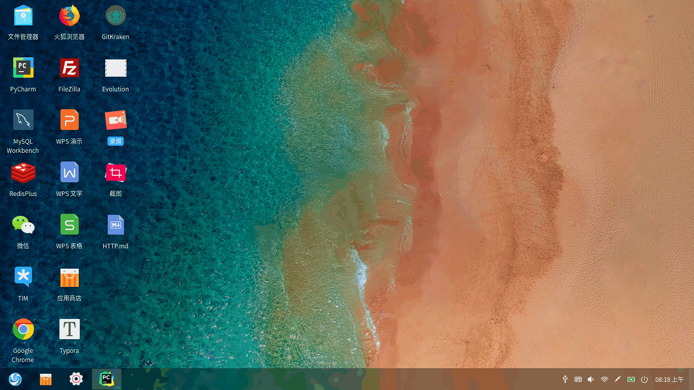
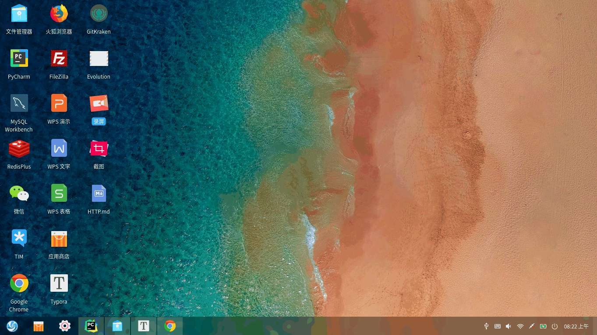

# weibo
基于自制 MVC Web 框架与 HTTP 服务器实现的类微博服务

#### MVC Web 框架

- Model 层使用自制的基于 MySQL 的ORM
- View 层通过 jinja2 模板渲染页面
- Controller 层利用 Python 的高阶函数与字典实现了路由的注册与分发，并将非业务部分抽象成装饰器以复用

#### HTTP 服务器

- 通过 Socket 通信
- 接收与解析 HTTP 请求
- 封装 MVC Web 框架结果并返回响应
- 利用多线程并发处理请求

#### weibo 主要功能

- 用户注册与登录
- Cookie/Session管理
- 密码安全存储
- 微博的添加、删除与评论

#### 演示

测试账号：shuo

密码：123

##### 登录

##### 注册

##### 微博操作

